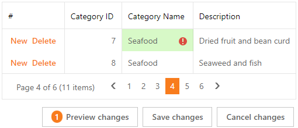

<!-- default badges list -->
[](https://supportcenter.devexpress.com/ticket/details/T1139925)
[](https://docs.devexpress.com/GeneralInformation/403183)
<!-- default badges end -->
# GridView for ASP.NET Web Forms - How to validate duplicate values in batch edit mode

This example demonstrates how to handle the [BatchEditRowValidating](https://docs.devexpress.com/AspNet/js-ASPxClientGridView.BatchEditRowValidating) event to validate duplicate values in batch edit mode.



Follow the steps below to enable this functionality:

1. Handle the grid's server-side [CustomJSProperties](https://docs.devexpress.com/AspNet/DevExpress.Web.ASPxGridView.CustomJSProperties) event to get cell values from the server.

2. Merge the cloned server-side values and the client-side changes to get unique values.

   ```js
   function GetUniqueColumnValuesForValidation(grid, columnIndex, editingRowKey, isModifying) {
       // Get the client-side changes
       var clientChanges = grid.batchEditApi.GetUnsavedChanges();
       
       var uniqueValues = GetServerUniqueValues(grid)[columnIndex];
   
       for (var rowKey in clientChanges.deletedValues) {
           var columnValue = clientChanges.deletedValues[rowKey][columnIndex];
           delete uniqueValues[columnValue];
       }
       for (var rowKey in clientChanges.insertedValues) {
           // ...
           var columnValue = clientChanges.insertedValues[rowKey][columnIndex];
           uniqueValues[columnValue] = true;
       }
       for (var rowKey in clientChanges.updatedValues) {
           // ...
           var serverColumnValue = grid.batchEditApi.GetCellValueByKey(rowKey, columnIndex, true);
           var newColumnValue = clientChanges.updatedValues[rowKey][columnIndex];

           delete uniqueValues[serverColumnValue];
           uniqueValues[newColumnValue] = true;
       }
   
       return uniqueValues;
   }
   ```

3. Handle the grid's [BatchEditRowValidating](https://docs.devexpress.com/AspNet/js-ASPxClientGridView.BatchEditRowValidating) event to validate duplicate values. Use the [validationInfo](https://docs.devexpress.com/AspNet/js-ASPxClientGridViewBatchEditRowValidatingEventArgs.validationInfo) argument property to get information about the processed cell and call the `ValidateUniqueColumnValues` function. This function gets the new value and checks if this value duplicates one of the unique values.

   ```js
   function OnBatchEditRowValidating(s, e) {
       for (var columnIndex in e.validationInfo) {
           var validationInfo = e.validationInfo[columnIndex];
           // ...
           ValidateUniqueColumnValues(s, validationInfo, parseInt(columnIndex), e.key);
       }
   }
   
   function ValidateUniqueColumnValues(grid, validationInfo, columnIndex, rowKey) {
       // ...
       var newClientValue = validationInfo.value;
       // ...
       var uniqueValues = GetUniqueColumnValuesForValidation(grid, columnIndex, rowKey, isModifying);
       if (uniqueValues[newClientValue]) {
           validationInfo.isValid = false;
           validationInfo.errorText = "Duplicate value";
       }
   }
   ```

## Files to Review

- [DuplicateValues.aspx](./CS/project1/DuplicateValues.aspx)
- [DuplicateValues.aspx.cs](./CS/project1/DuplicateValues.aspx.cs) (VB: [DuplicateValues.aspx.vb](./VB/project1/DuplicateValues.aspx.vb))

## Documentation

- [BatchEditMode](https://docs.devexpress.com/AspNet/16443/components/grid-view/concepts/edit-data/batch-edit-mode)
- [BatchEditRowValidating](https://docs.devexpress.com/AspNet/js-ASPxClientGridView.BatchEditRowValidating)
- [CustomJSProperties](https://docs.devexpress.com/AspNet/DevExpress.Web.ASPxGridView.CustomJSProperties)
- [GetUnsavedChanges](https://docs.devexpress.com/AspNet/js-ASPxClientGridViewBatchEditApi.GetUnsavedChanges)

## More Examples

- [GridView for ASP.NET Web Forms - How to implement custom date validation in batch edit mode](https://github.com/DevExpress-Examples/aspxgridview-how-to-implement-custom-date-validation-in-batch-edit-mode-t171182)
